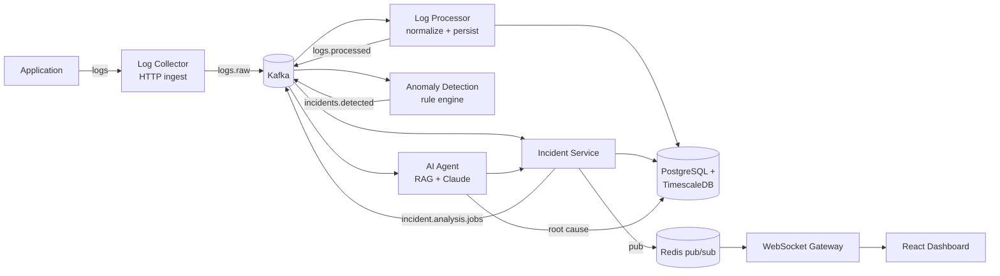

# Architecture

## Codebase layout

```
frontend/                  React dashboard (Vite + TS)
backend/
  shared/                  @ai-incident/shared — resilience, Kafka, Redis, types
  services/
    log-collector/         HTTP ingest → Kafka
    log-processor/          normalize + persist → Kafka
    anomaly-detection/      rule engine → Kafka
    incident-service/       persistence + WebSocket gateway
    ai-agent/                RAG + Claude root-cause narrative
infra/
  docker-compose.yml       Kafka, Redis, Postgres/Timescale, all services
  postgres/init.sql
  kafka/topics.md
docs/ARCHITECTURE.md       this file
```

`backend/services/*` are independently deployable Node.js processes that
only talk to each other through Kafka, Postgres, or Redis — never a direct
HTTP call between them — so the layout mirrors the runtime topology, not
just a code-organization convenience.

## Pipeline



Each arrow between services is a Kafka topic, not a direct call — every
stage can fail, restart, or scale independently without taking the others
down.

## Why each piece is there

| Component | Role | Why this and not a direct call |
|---|---|---|
| **Kafka** | `logs.raw`, `logs.processed`, `incidents.detected`, `incident.analysis.jobs` | Single event backbone for the whole pipeline, including the AI agent's job queue: keyed by `incidentId` so retries of the same incident land on the same partition, with a `.dlq` topic per topic for messages that exhaust their retry budget. One broker to run and reason about instead of Kafka *and* a separate job queue for what is, at this scale, the same delivery problem. |
| **Redis** | (a) hot cache for anomaly-detection's sliding window counters, (b) pub/sub fan-out from incident-service to every WebSocket gateway instance, (c) shared circuit-breaker state | Sub-millisecond counters for rate-based rules (e.g. "how many 5xx in the last 60s") and pub/sub so a dashboard client can connect to *any* incident-service replica and still see updates raised by another replica. |
| **WebSocket** | incident-service → dashboard | Incidents and their evolving root-cause analysis are pushed, not polled — the dashboard should show "Redis became unavailable at 12:41" the moment the AI agent writes it. |
| **PostgreSQL + TimescaleDB** | `raw_logs`/`metrics` hypertables, `incidents`, `incident_events`, `root_cause_analyses` | One durable store for both time-series log/metric data (Timescale hypertables give continuous aggregates + retention policies on top of plain Postgres) and relational incident state, so an incident row can join straight against the metrics that triggered it. |
| **pgvector** (Postgres extension) | `runbooks` embeddings | RAG corpus lives next to the data it's reasoning about instead of a separate vector DB — one fewer moving part, and the retriever can join embeddings against structured incident history in a single query. |
| **Claude (Anthropic API)** | root-cause narrative generation | Takes the anomaly signals + retrieved runbook/past-incident context and produces the plain-English explanation (see example below). |

RabbitMQ was considered for the AI-agent job queue (its per-message ack/nack
model is a natural fit for "one message = one expensive LLM call") but was
dropped: it would duplicate Kafka's retry/DLQ role for no capability this
project actually needs, at the cost of a second broker to run and monitor.
Reach for it if the job queue later needs things Kafka doesn't do well —
priority queues, per-message TTLs, or fair scheduling across many small
tenants.

## Fault tolerance patterns

Every consumer/producer in this system uses the shared primitives in
[`backend/shared/src/resilience/`](../backend/shared/src/resilience):

- **Retry with backoff** (`retry.ts`) — exponential backoff + jitter, capped
  attempts, used around every Postgres write, Redis call, and outbound HTTP/
  LLM call. Transient failures (a Postgres pool blip, a Redis timeout) self-heal
  without operator intervention.
- **Circuit breaker** (`circuitBreaker.ts`) — wraps calls to Redis, Postgres,
  and the Claude API. After a failure threshold, the breaker opens and
  fails fast for a cooldown window instead of piling up retries against a
  dependency that's already down — this is exactly the "Redis became
  unavailable" scenario the AI agent is meant to diagnose, so the platform's
  own resilience code has to survive it, not just report on it.
- **Dead-letter queue** — a message that exhausts its retry budget (bad
  payload, poison message, permanently failing downstream) goes to
  `<topic>.dlq` instead of being dropped or blocking the partition. DLQ
  contents are inspectable and replayable.
- **Idempotency** — every event carries a stable `eventId`; consumers upsert
  on that id so Kafka's at-least-once delivery never double-creates an
  incident or double-counts a metric.

## Example: what the AI agent reads and writes

Anomaly-detection emits structured signals like:

```json
{ "type": "redis_timeout", "service": "checkout-api", "at": "2026-09-03T12:41:00Z" }
{ "type": "pg_pool_exhausted", "service": "checkout-api", "at": "2026-09-03T12:44:00Z", "poolUtilization": 1.0 }
{ "type": "http_5xx_spike", "service": "checkout-api", "at": "2026-09-03T12:42:30Z", "rate": 0.18 }
```

`backend/services/ai-agent` retrieves similar past incidents/runbooks via
pgvector, builds a timeline from `incident_events`, and asks Claude to
explain it. The target output shape:

```
Possible root cause:

Redis became unavailable at 12:41.
This caused database fallback requests, increasing PostgreSQL connections by 380%.
The connection pool was exhausted at 12:44.
```

## Data model (summary)

- `raw_logs` (Timescale hypertable) — every ingested log line, partitioned by time.
- `metrics` (Timescale hypertable) — CPU/latency/error-rate/pool-utilization samples.
- `incidents` — id, status, severity, opened/resolved timestamps, summary.
- `incident_events` — ordered timeline of signals attached to an incident (FK to `incidents`).
- `root_cause_analyses` — the AI agent's narrative + the signals/runbooks it cited, FK to `incidents`.
- `runbooks` — postmortem/runbook text + `vector` embedding column (pgvector) for RAG retrieval.

Full DDL: [`infra/postgres/init.sql`](../infra/postgres/init.sql).

## Scaling & deployment notes

- Every service is a stateless Node.js process — horizontal scaling is
  "run more replicas"; state lives in Kafka/Postgres/Redis.
- Kafka topics are partitioned by `service` (or `incidentId` for the
  analysis-job topic) so per-key ordering is preserved while different
  keys process in parallel.
- `incident-service` can run N replicas behind a load balancer; Redis
  pub/sub is what makes WebSocket fan-out work correctly across replicas.
- `infra/docker-compose.yml` runs the whole stack locally for development;
  see it for the concrete images/ports/env used by each service.
